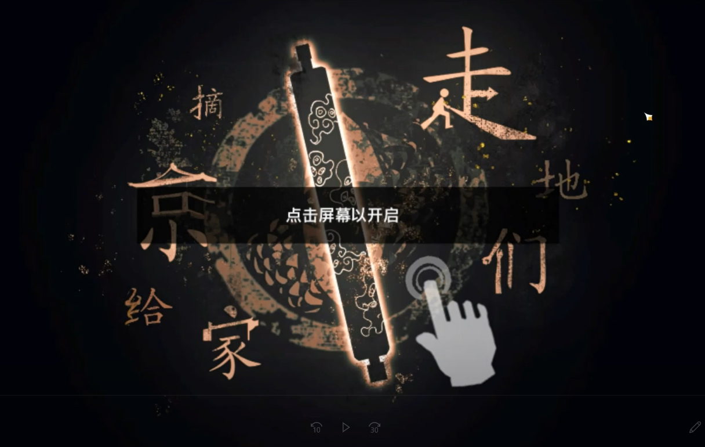
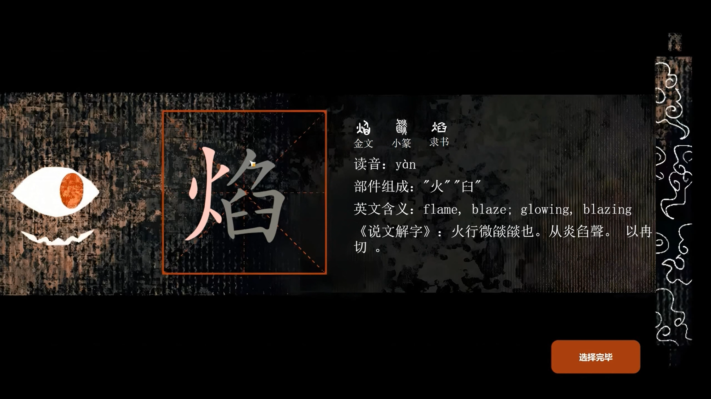
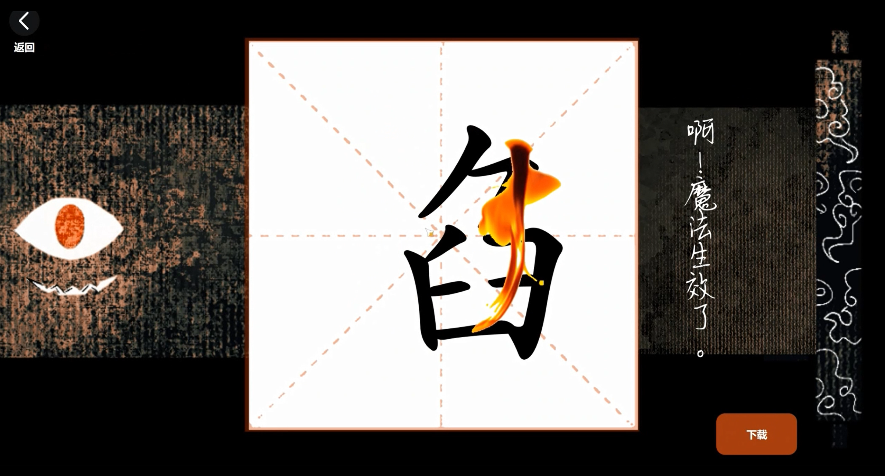
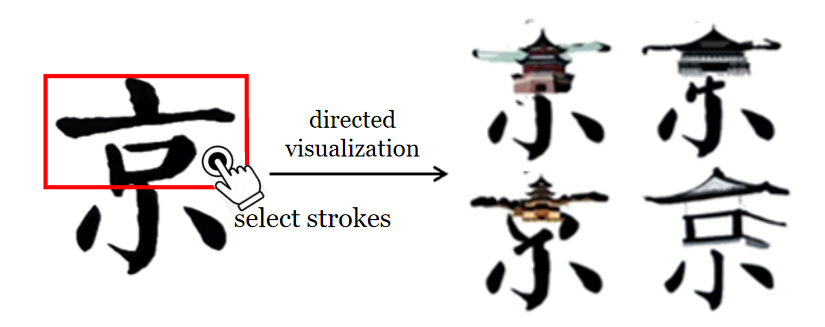
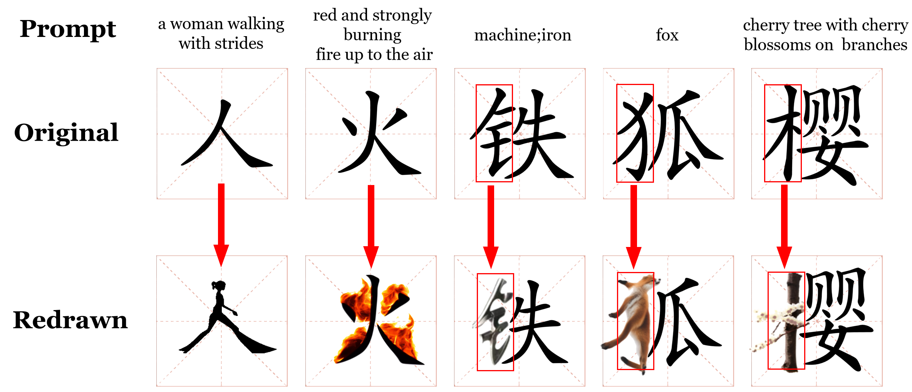

# Glyph Genius / 辞海古卷


## Intro

This project is the core IP of the team "Wisdom Bead Team", formed in 2023 due to an innovative project. I had the privilege of being one of the developers involved in the entire process of the project from idea to initial implementation. The current project website: [https://scroll.ihanzi.net/](https://scroll.ihanzi.net/release.html)


## Project Structure

```
root/ 根目录
│
├── background/          UI background image folder
│
├── character/           Chinese character SVG folder
│
├── flask/               Python-Flask framework backend code folder
│
├── ttf/                 Oracle bone script and other Chinese character TTF folder
│
├── static/             
│    ├── icon/           Interaction icon folder
│    │
│    ├── js/             Static js library folder
│    │
│    ├── initial.jpg     Initial waiting interface Image
|    └── welcome.gif     Welcome animation
│
├── home.css             Main page CSS file
├── home.html            Main page HTML file
└── server.js            Node-Webpack deployment script
```


## Preparation

The project is essentially an HTML webpage. For debugging convenience, you can use VSCode for code editing and utilize the Live Server (Ritwick Dey) real-time debugging plugin within VS Code for editing. After installation, right-click on the .html file and select "Open with Live Server" to view the frontend webpage.


### External API Integration

Visit [Baidu Translate](https://api.fanyi.baidu.com/) to apply for the use of a free translation interface. Replace the APP-ID and SecretKey in main.py with your own. Visit [Baidu OCR](https://ai.baidu.com/ai-doc/index/OCR) to apply for OCR recognition interface usage. Replace the /recognize in main.py accordingly.


### Backend Deployment

The backend is developed using the Flask framework, and the code is in the /flask folder. Due to insufficient cloud server configuration for deploying this framework, the drawing and OCR models are deployed on the campus workstation, accessible through the external port of the Information Office. The internal IP addresses in the code have been hidden.


### Frontend Deployment

Ensure that Node.js is installed on your computer/server. Create an npm project in an empty folder:
```
Npm init

npm install
```

Install the necessary packages for webpack deployment:
```
npm  install express --save
```

Run server.js to open the port 8092 for access:
```
node server.js
```


## System Overview

Initial Interface



Stroke Selection



Stroke Recombination



Download Result


Stroke Selection Illustration




Design Result Illustration




## Version History

### v1.0.0

May 21, 2023, Double-click to open the scroll.

June 12, 2023, Support for computer mouse and mobile tablet touch (touchscreen not supported yet), basic interactions on various functional pages.

GIFs and images load slowly in the webpage due to limited cloud server bandwidth. Once all pages are loaded, the issue will be resolved.

### v1.1.0
Feature Updates:

1. Click to select a stroke, click again to deselect.
2. Smoother handwriting when writing Chinese characters.
3. Errors in recognition or no results will throw errors and return to the writing interface.
4. Render 6 images at once.
5. Flash selected strokes in the 6 images.
6. Progress popup displayed during rendering, allowing cancellation of rendering even if not completed.
7. Single-click on the startup page to launch the scroll.
8. UI optimization for the input label page.

Logic Optimization:

Previously, the SVG content was fetched every time it was displayed, using the fetch function to retrieve it, and then recording which strokes were selected in an array. Now, the content of the SVG file is fetched only once in the onload load, and the result is deeply copied into three variables, which can be passed between different phases without the need to define an array to record selected strokes, reducing many asynchronous operations:
* svgDoc_leave displayed on the canvas
* svgDoc_send sent to the AI for rendering
* svgDoc_leave_deepcopy used to store the selected strokes, turning selected strokes pink and unselected strokes gray.


### v1.2.0

Feature Updates:

1. Added exhibition of ancient characters such as Oracle bone script, and added interfaces for Shuowen Jiezi.
2. After selecting one of the 6 rendered images, you can return to reselect.
3. Support for tablet touch screen use.


### v1.3.0

Refactor:

1. Change the background images from PNG format to WebP format resolved the slow loading issue in the previous versions


