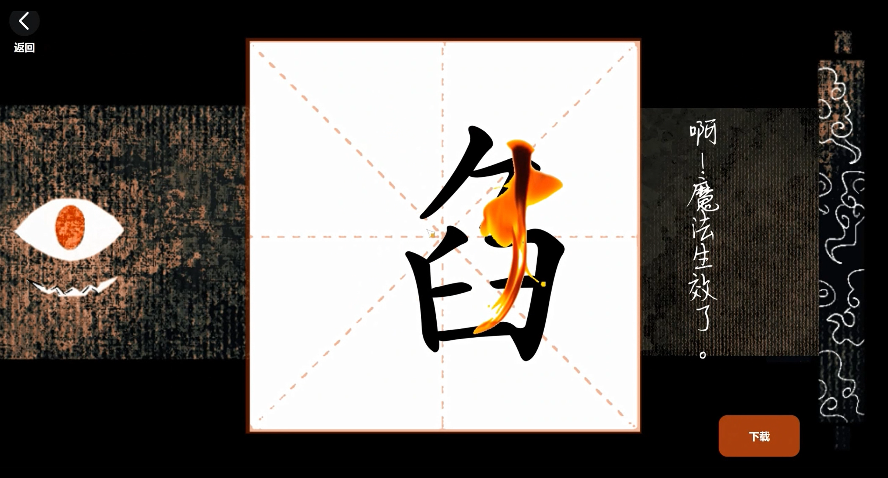
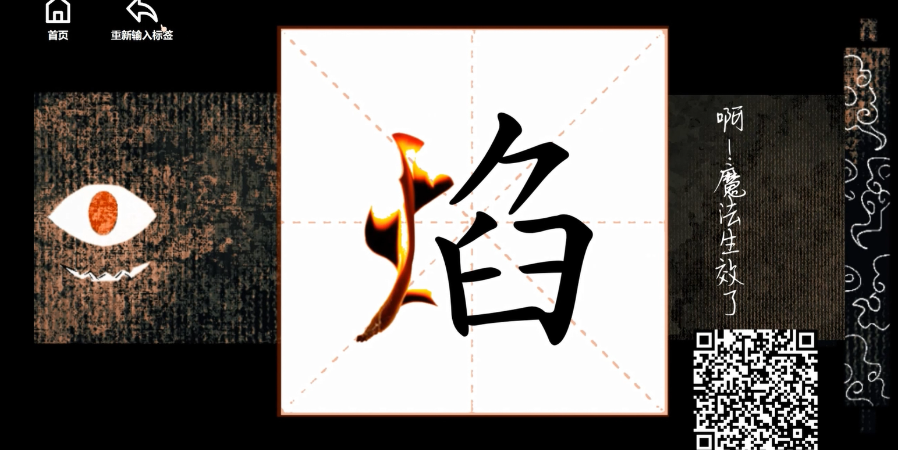
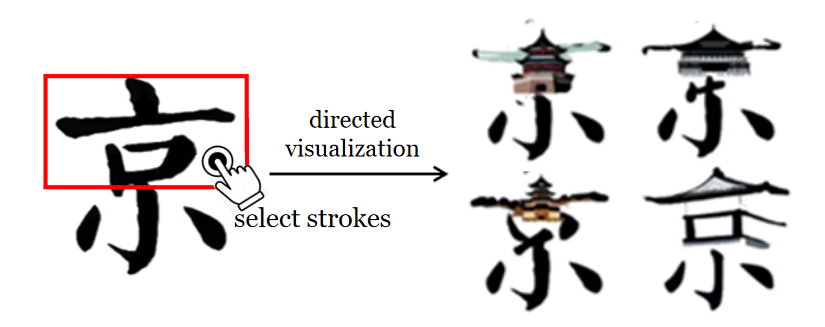

# 辞海古卷 / Glyph Genius

- zh_CN [简体中文](README.zh_CN.md)
- en [English](README.md)

## 简介

本项目是2023年因创新项目结识组成的团队 “智慧珠珠队” 的核心IP（个人比较喜欢卷济神经网络这个名字）。有幸作为开发者之一参与该项目从idea到初步落地的全流程，做此纪念。当前项目网址：[https://scroll.ihanzi.net/](https://scroll.ihanzi.net/release-en.html)


## 项目架构

```
root/ 根目录
│
├── background/          ui 背景图文件夹
│
├── character/           汉字 SVG 文件夹
│
├── flask/               python-flask 框架后端代码文件夹
│
├── ttf/                 甲骨文、金文等汉字 TTF 文件夹
│
├── static/             
│    ├── icon/           系统交互 icon文件夹
│    │
│    ├── js/             引入静态 js 库文件夹
│    │
│    ├── initial.jpg     初始等待界面
|    └── welcome.gif     欢迎动画
│
├── home.css             主页面 CSS 文件
├── home.html            主页面 HTML 文件
└── server.js            node-webpack 部署脚本
```


## 准备工作
项目本质是 HTML 网页。调试时为方便可以使用 VSCode 进行代码编辑，采用 VS code 中的 Live Server (Ritwick Dey) 实时调试插件进行编辑。安装完成后在 .html 文件中右键并选中 "open with live server"即可查看到前端网页。


### 外部接口接入
访问 [Baidu Translate](https://api.fanyi.baidu.com/) 可申请使用免费翻译接口，在 main.py 中的 /translate 改为自己的 APP-ID 与 SecretKey 即可。访问[Baidu OCR](https://ai.baidu.com/ai-doc/index/OCR)可申请使用 OCR 识别接口，在 main.py 中的 /recognize 进行替换。


### 后端部署
后端使用 Flask 框架开发，代码在 /flask 文件夹下。由于部署本框架的云服务器配置不够，故将绘画大模型、OCR模型部署在校内工作站上，通过信息办的外网端口访问，代码中内网 IP 地址均已隐去。


### 前端部署
首先确保电脑/服务器上已安装 node，再在空文件夹中创建 npm 项目：
```
Npm init

npm install
```

安装 webpack 部署所需的包：
```
npm  install express --save
```

执行 server.js 开放端口访问：
```
node server.js
```


## 界面展示

初始界面


选择笔画


笔画重组



下载结果




选择笔画示意图



设计结果示意图


## 版本历史

### v1.0.0

2023年5月21日，双击打开卷轴

2023年6月12日，支持电脑鼠标、手机平板触摸（触摸屏暂不支持），可以在各基本功能页行基本交互

网页里面gif和图片加载的很慢，是云服务器带宽不够，耐心等一次把所有页面加载完毕之后就没问题了
PS : v1.2.1 已将背景图更改为 webp，加载更快。 

### v1.1.0
更新功能：

1. 点击笔画选中，再次点击取消
2. 写汉字时笔迹更加丝滑
3. 识别出现错误/没有结果等会抛出错误并重回写字界面
4. 一次渲染 6 张图片
5. 在 6 张图片中作出选择时，选中的笔画闪烁
6. 渲染时弹窗显示进度，没渲染完也可以点击取消渲染
7. 开屏页单击即可启动卷轴
8. 优化输入标签页的 UI

优化逻辑：

原先每次显示svg时都使用fetch函数去取，再通过一个记录选中了哪几笔的数组变粉；现在svg文件的内容只在onload加载中取一次，取到的结果深拷贝进入三个变量，变量可以在不同phase间传递，不用再定义一个数组记录选中了哪几笔了，也减少了很多异步操作：
* svgDoc_leave 画布上显示的
* svgDoc_send 发送给 AI 渲染的
* svgDoc_leave_deepcopy 因为最后需要将选中的笔画删除，这个变量用来存放选中变粉、不中变灰的那个内容


### v1.2.0

更新功能：

1. 加入甲骨文等古文字展位、加入说文解字等接口
2. 点击选中 6 张渲染结果之一后可以返回重新选择
3. 支持平板触摸屏使用


### v1.2.1

重构：

1. 将背景图从 png 格式更换为 webp 格式，解决了之前版本中的加载慢的问题


### v1.3.0

更新功能：

1. 更新英文版本，未来可能继续完善，做语言切换功能
2. 更换了“返回”的 icon 
